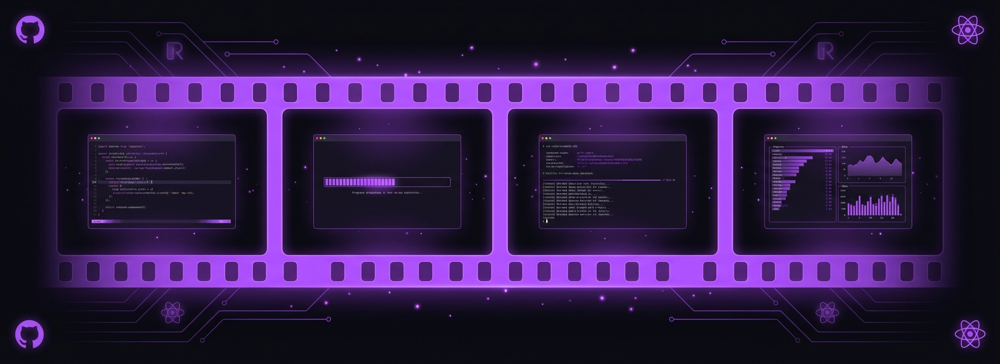

# trackly-cli-video 🎬 — Animated product launch videos built with React, rendered as MP4.

<p align="center">
  
</p>

<p align="center">
  
  
  
  
</p>

A framework for creating polished product launch videos entirely in code — no After Effects, no timeline editors. Write React components, preview in the browser, render to MP4. Same approach the Anthropic Claude Code team uses for their feature announcements.

First video: **Trackly CLI launch** — 8 scenes, 1080x1080, 30fps, 36 seconds, 3MB MP4. Showcases `npm install`, OAuth login, job search, AI queries, MCP integration, API keys, and a multi-platform CTA.

## What it does

- Builds animated videos as React components — each scene is a `.tsx` file
- Spring-based animations for organic motion (no linear tweens)
- Reusable terminal component with typing animation, blinking cursor, and progressive output
- Scene transition system with fade in/out (last scene holds solid for CTA)
- Hot-reload preview in browser via Remotion Studio
- Renders to MP4 at any resolution (1080x1080 for X/LinkedIn, 1270x760 for Product Hunt)

## How it works

```
src/
├── Root.tsx              # Composition config (frames, fps, dimensions)
├── TracklyLaunch.tsx     # Series sequencer — scenes in <Series.Sequence>
├── theme.ts              # Design tokens: colors, fonts (single source of truth)
├── components/
│   ├── Terminal.tsx       # Mac-style terminal with typing + output animations
│   └── FadeIn.tsx        # Spring-based FadeIn + ScaleIn wrappers
└── scenes/               # One file per scene, self-contained
    ├── Scene1Install     # npm install with ASCII art reveal
    ├── Scene2Login       # OAuth flow with browser popup
    ├── Scene3Jobs        # Job listings table, row-by-row spring animation
    ├── Scene4Ask         # Natural language AI query
    ├── Scene5MCP         # JSON config block + agent badges
    ├── Scene6ApiKey      # API key creation flow
    ├── Scene7Pillars     # Three access methods with SVG icons
    └── Scene8CTA         # App icon, platform badges, install command
```

```
Write scenes as React → Preview in Remotion Studio (localhost:3000)
  → Iterate with hot-reload
  → Render: npx remotion render src/index.ts TracklyLaunch out/trackly-launch.mp4
  → Share on X / LinkedIn / WhatsApp
```

## Tech stack

- **Framework:** Remotion 4 (React-based video engine)
- **Styling:** TailwindCSS via `@remotion/tailwind`
- **Animations:** `spring()` + `interpolate()` from Remotion (no CSS keyframes)
- **Rendering:** Chrome Headless Shell → MP4
- **Agent skills:** Remotion official skills from `remotion-dev/skills` (animations, timing, transitions)

## What I learned

- Spring animations (`damping: 12-20, stiffness: 60-100`) feel dramatically better than linear interpolation — every element in the video uses `spring()` and the motion feels organic instead of robotic
- Emoji characters render as black glyphs on dark backgrounds and are completely invisible — the fix is inline SVGs with explicit `fill` colors matching the theme, which also gives you precise sizing control
- The last scene in any video should never fade out — removing the transition wrapper so the CTA holds solid gives viewers time to read and act, which is the whole point of the video
